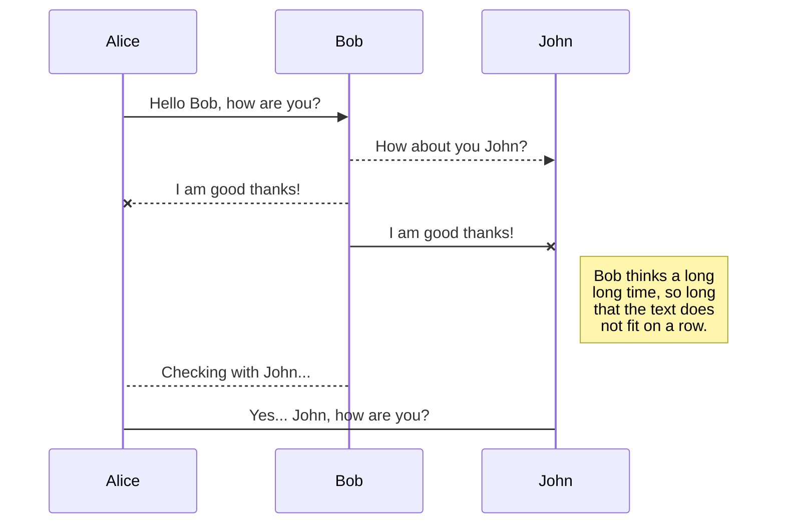

# Overview

Markdown is a lightweight markup language with plain text formatting syntax. It's the de-facto syntax for writing documentation on major code repositories such as GitHub.

Wiki.js supports the full [CommonMark specification](https://spec.commonmark.org/) + adds some useful extensions (including the Github Flavored Markdown addons).

# User Guide

## Blockquotes

### Tab {.tabset}

#### Usage

Using a **greater-than** symbol, followed by a space, before each line of text.

#### Shortcuts
- By selecting text, then clicking the {.radius-4} button in the toolbar.

#### Examples

```js
> Lorem ipsum dolor sit amet
> Consectetur adipiscing elit
```

> Lorem ipsum dolor sit amet
> Consectetur adipiscing elit

#### Stylings

By adding a class on a separate line, after the blockquote, you can change the look of the blockquote. Note that these stylings are specific to Wiki.js and will fallback to standard blockquote styling in other applications.

- Blue: `is-info`
- Green: `is-success`
- Yellow: `is-warning`
- Red: `is-danger`

```css
> Lorem ipsum dolor sit amet
> Consectetur adipiscing elit
{.is-info}
```

> This is a default unstyled blockquote.

> This is a `{.is-info}` blockquote.
{.is-info}

> This is a `{.is-success}` blockquote.
{.is-success}

> This is a `{.is-warning}` blockquote.
{.is-warning}

> This is a `{.is-danger}` blockquote.
{.is-danger}

## Bold

### Tab {.tabset}

#### Usage

Using **double asterisks** symbols before and after the text selection.

#### Shortcuts
- By selecting text, then clicking the {.radius-4} button in the toolbar.
- By selecting text, then pressing <kbd>CTRL</kbd> + <kbd>B</kbd>

#### Examples

```js
Lorem **ipsum** dolor
```

Lorem **ipsum** dolor

## Code Blocks

### Tab {.tabset}

#### Usage

Using **triple backticks** symbols before and after the text selection, on dedicated lines.

#### Shortcuts
- Using the **Code Block** tool in the left toolbar.

#### Examples

````
```
function lorem (ipsum) {
	const dolor = 'consectetur adipiscing elit'
}
```
````

#### Syntax Highlighting

By default, a code block is rendered as plain preformatted text. It's however preferable to use syntax highlighting for programming code, allowing for easier readability. To specify the programming language used in the code block, simply add the language keyword right after the opening triple backticks:

````java
```java
// some code here
```
````

Refer to the [reference list](https://github.com/highlightjs/highlight.js#supported-languages) of about 185 supported programming languages.

## Content Tabs

### Tab {.tabset}

#### Usage

> This feature is only available from version 2.4 and up.
{.is-info}

Using headers and adding the `{.tabset}` class to the parent header. The parent header text will not be shown in the final result.

Note that you can use any header level, as long as the children headers are one level higher. For example, if a parent header is `###` *(h3)*, the tabs headers must be `####` *(h4)*. The maximum header level for a parent being 5 and the children 6.

#### Examples

```
# Tabs {.tabset}
## First Tab

Any content here will go into the first tab...

## Second Tab

Any content here will go into the second tab...

## Third Tab

Any content here will go into the third tab...
```

## Emojis

### Tab {.tabset}

#### Usage

Using the syntax `:identifier:`

See the [Emoji Cheat Sheet](https://www.webfx.com/tools/emoji-cheat-sheet/) for the full list of possible options.

#### Examples

```markdown
:apple:

Can be also be used :fire: inline
```

:apple:

Can also be used :fire: inline.

## Footnotes

### Tab {.tabset}

#### Usage

Use the syntax `[^1]` for the location of the footnote in the main text, and `[^1]: this is a footnote` for the actual footnote.  Footnotes themselves will automatically appear at the bottom of the page under a horizontal line.

#### Examples

```markdown
This sentence[^1] needs a few footnotes.[^2]

[^1]: A string of syntactic words.
[^2]: A useful example sentence.
```
This sentence[^1] needs a few footnotes.[^2]

[^1]: A string of syntactic words.
[^2]: A useful example sentence.

## Headers

### Tab {.tabset}

#### Usage

Using between 1 and 6 **hashtag** symbol(s), followed by a space, before the text selection.

#### Shortcuts
- On the desired line, then clicking the {.radius-4} dropdown button in the toolbar.
- On the desired line, press <kbd>CTRL</kbd> + <kbd>ALT</kbd> +  <kbd>Right</kbd> to increase the header level.
- On the desired line, press <kbd>CTRL</kbd> + <kbd>ALT</kbd> +  <kbd>Left</kbd> to decrease the header level.

#### Examples

```
# Header 1
## Header 2
### Header 3
#### Header 4
##### Header 5
###### Header 6
```

## Horizontal Line

### Tab {.tabset}

#### Usage

Using **triple dash** symbols on a dedicated line.

#### Shortcuts
- By clicking the {.radius-4} button in the toolbar.

#### Examples

```js
Lorem ipsum dolor

---

Consectetur adipiscing elit
```

Lorem ipsum dolor

---

Consectetur adipiscing elit

## Images

### Tab {.tabset}

#### Usage

Using the syntax ``.

#### Shortcuts
- Using the **Assets** tool in the left toolbar.

#### Examples

```markdown


Consectetur  elit
```

#### Dimensions

Sometimes images are too large or maybe you want the image to fill up all the available space.

Simply at the dimensions at the end of the image path in the following format:

```

```

You can also omit one of the values to automatically keep the image ratio:

```


```

It's also possible to use other units, like %. Useful when you need the image to take all the available space:

```

```

#### Aligning

Images can also be pinned to top right using the following syntax:

```
{.align-abstopright}
```

## Inline Code

### Tab {.tabset}

#### Usage

Using a **backtick** symbol before and after the text selection.

#### Shortcuts
- By selecting text, then clicking the {.radius-4} button in the toolbar.

#### Examples

```js
Lorem `ipsum` dolor
```

Lorem `ipsum` dolor

## Italic

### Tab {.tabset}

#### Usage

Using a **single asterisk** symbol before and after the text selection.

#### Shortcuts
- By selecting text, then clicking the {.radius-4} button in the toolbar.
- By selecting text, then pressing <kbd>CTRL</kbd> + <kbd>I</kbd>

#### Examples

```js
Lorem *ipsum* dolor
```

Lorem *ipsum* dolor

## Keyboard Keys

### Tab {.tabset}

#### Usage

Using `<kbd>` before and `</kbd>` after the text selection.

#### Shortcuts
- By selecting text, then clicking the {.radius-4} button in the toolbar.

#### Examples

```html
Lorem ipsum dolor <kbd>CTRL</kbd> + <kbd>C</kbd>
```

Lorem ipsum dolor <kbd>CTRL</kbd> + <kbd>C</kbd>

## Links

### Tab {.tabset}

#### Usage

Using the syntax `[Link Text](Link Target)`.

#### Shortcuts
- Using the **Link** tool in the left toolbar.

#### Examples

```markdown
[Lorem ipsum](https://wiki.js.org/about)

Consectetur [adipiscing](/install/requirements) elit
```

[Lorem ipsum](https://wiki.js.org/about)

Consectetur [adipiscing](/install/requirements) elit

## Mermaid Diagrams

### Tab {.tabset}

#### Usage

Using a code block with the language **mermaid**.

Refer to [Mermaid website](https://mermaid-js.github.io/mermaid) for the language reference.

#### Examples

````

````

## Ordered Lists

### Tab {.tabset}

#### Usage

Using an **number**, followed by a **dot** symbol, followed by a space, before each line of text.

#### Shortcuts
- By selecting text, then clicking the {.radius-4} button in the toolbar.

#### Examples

```
1. Lorem ipsum dolor sit amet
1. Consectetur adipiscing elit
1. Morbi vehicula aliquam
```

1. Lorem ipsum dolor sit amet
1. Consectetur adipiscing elit
1. Morbi vehicula aliquam

> While you can number each line numerically in order, it's easier to use the number **1** on each line. The final result will be incremented automatically. This way you don't need to re-number every single line when adding or removing a line later on.
{.is-info}

## PlantUML Diagrams

### Tab {.tabset}

#### Usage

Using a code block with the language **plantuml**.

Refer to [PlantUML website](https://plantuml.com/) for the language reference.

#### Examples

````
```plantuml
Bob->Alice : hello
```
````

```plantuml
Bob->Alice : hello
```

## Strikethrough

### Tab {.tabset}

#### Usage

Using **double tildes** symbols before and after the text selection.

#### Shortcuts
- By selecting text, then clicking the {.radius-4} button in the toolbar.

#### Examples

```js
Lorem ~~ipsum~~ dolor
```

Lorem ~~ipsum~~ dolor

## Subscript

### Tab {.tabset}

#### Usage

Using a **single tilde** symbol before and after the text selection.

#### Shortcuts
- By selecting text, then clicking the {.radius-4} button in the toolbar.

#### Examples

```js
Lorem ~ipsum~ dolor
```

Lorem ~ipsum~ dolor

## Superscript

### Tab {.tabset}

#### Usage

Using a **single caret** symbol before and after the text selection.

#### Shortcuts
- By selecting text, then clicking the {.radius-4} button in the toolbar.

#### Examples

```js
Lorem ^ipsum^ dolor
```

Lorem ^ipsum^ dolor

## Task Lists

### Tab {.tabset}

#### Usage

Using the syntax `- [ ]` or a `- [x]`.

#### Examples

```
- [x] Checked task item
- [x] Another checked task item
- [ ] Unchecked task item
```

- [x] Checked task item
- [x] Another checked task item
- [ ] Unchecked task item

## Unordered Lists

### Tab {.tabset}

#### Usage

Using an **asterisk** or a **dash** symbol, followed by a space, before each line of text.

#### Shortcuts
- By selecting text, then clicking the {.radius-4} button in the toolbar.

#### Examples

```
- Lorem ipsum dolor sit amet
- Consectetur adipiscing elit
- Morbi vehicula aliquam
```

- Lorem ipsum dolor sit amet
- Consectetur adipiscing elit
- Morbi vehicula aliquam

#### Stylings

By adding a class on a separate line, after the list, you can change the look of the list:

- `links-list`
- `grid-list`

For example:

```markdown
- Grid Item 1
- Grid Item 2
- Grid Item 3
{.grid-list}

- [Lorem ipsum dolor sit amet *Subtitle description here*](https://www.google.com)
- [Consectetur adipiscing elit *Another subtitle description here*](https://www.google.com)
- [Morbi vehicula aliquam *Third subtitle description here*](https://www.google.com)
{.links-list}
```
will result in:

- Grid Item 1
- Grid Item 2
- Grid Item 3
{.grid-list}

and:

- [Link Title 1 *Subtitle description here*](https://www.google.com)
- [Link Title 2 *Another subtitle description here*](https://www.google.com)
- [Link Title 3 *Third subtitle description here*](https://www.google.com)
{.links-list}

> Note that these stylings are specific to Wiki.js and will fallback to standard list styling in other applications.
{.is-warning}
