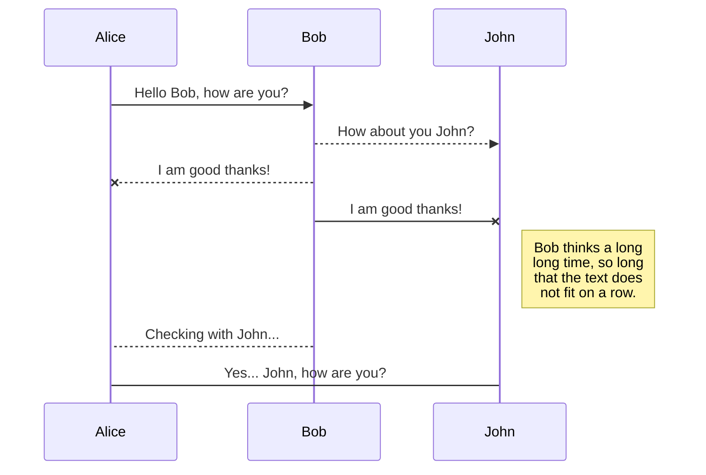

# 概述

Markdown是一种具有纯文本格式语法的轻量级标记语言。这是在GitHub等主要代码库上编写文档的事实语法。

Wiki.js支持完整的[CommonMark specification](https://spec.commonmark.org/)，并添加了一些有用的扩展（包括Github Flavored Markdown插件）。

# 用户指南

## 引用

### Tab {.tabset}

#### 用法

在每行文本之前使用**大于号**，后跟空格。

#### 快捷方法
- 选择文本，让后单击工具栏中的 {.radius-4} 按钮。

#### 示例

```js
> Lorem ipsum dolor sit amet
> Consectetur adipiscing elit
```

> Lorem ipsum dolor sit amet
> Consectetur adipiscing elit

#### 样式

通过在块引号之后空出一行，并在这一行上添加类，您可以更改块引号的外观。请注意，这些样式是Wiki.js特有的，将在其他应用程序中回退到标准的blockquote样式。

- Blue: `is-info`
- Green: `is-success`
- Yellow: `is-warning`
- Red: `is-danger`

```css
> Lorem ipsum dolor sit amet
> Consectetur adipiscing elit
{.is-info}
```

> 这是默认的未设置样式的块引用。

> 这是信息型块引用。
{.is-info}

> 这是成功型块引用。
{.is-success}

> 这是警告型块引用。
{.is-warning}

> 这是错误型块引用。
{.is-danger}

## 加粗

### Tab {.tabset}

#### 用法

在要加粗的文本前后分别添加**两个星号**。

#### 快捷方法
- 选择文本，然后单击工具栏中的 {.radius-4} 按钮。
- 选择文本，然后按 <kbd>CTRL</kbd> + <kbd>B</kbd>

#### 示例

```js
Lorem **ipsum** dolor
```

Lorem **ipsum** dolor

## 代码块

### Tab {.tabset}

#### 用法

在代码前后分别空出一行，添加三个反引号。

#### 快捷方法
- 使用左侧工具栏中的**代码块**工具。

#### 示例

````
```
function lorem (ipsum) {
	const dolor = 'consectetur adipiscing elit'
}
```
````

#### 代码高亮

默认情况下，代码块呈现为预格式化纯文本文本。然而，编程代码最好使用语法高亮显示，这样可读性更好。要指定代码块中使用的编程语言，只需在开头的三个反引号后面添加语言关键字：

````java
```java
// some code here
```
````

您可以查看支持高亮的185种编程语言的[参考列表](https://github.com/highlightjs/highlight.js#supported-languages)。

## 内容标签

### Tab {.tabset}

#### 用法

> 此功能仅适用于2.4及更高版本。
{.is-info}

使用标题并将`｛.tabset｝`类添加到父标题。父标题文本不会显示在最终结果中。

请注意，您可以使用任何标题级别，只要子标题高一级即可。例如，如果父标题为`###`*（h3）*，则选项卡标题必须为`####`*（h4）*。父标题的最大标头级别为5，子标题为6。

#### 示例

```
# Tabs {.tabset}
## 第一个选项卡

这里的任何内容都将进入第一个选项卡。。。

## 第二个选项卡

这里的任何内容都将进入第二个选项卡。。。

## 第三个选项卡

这里的任何内容都将进入第三个选项卡。。。
```

## Emojis

### Tab {.tabset}

#### 用法

使用语法 `:identifier:`

所有可使用emoji参见[Emoji速查表](https://www.webfx.com/tools/emoji-cheat-sheet/)。

#### 示例

```markdown
:apple:

也可以在行内 :fire: 使用
```

:apple:

也可以在行内 :fire: 使用

## 脚注

### Tab {.tabset}

#### 用法

在需要设置脚注的位置使用如下语法 `[^1]`， 使用语法 `[^1]: 这是一段脚注` 来添加具体的脚注。脚注本身将自动显示在页面底部的水平线下。

#### 示例

```markdown
这句话[^1] 需要一些脚注。[^2]

[^1]: 一串句法单词。
[^2]: 一个有用的例句。
```
这句话[^1] 需要一些脚注。[^2]

[^1]: 一串句法单词。
[^2]: 一个有用的例句。

## 标题

### Tab {.tabset}

#### 用法

在要添加标题的文本前另起一行，使用1到6个**标签号（井号）**，后跟空格。

#### 快捷方式
- 将光标置于要添加标题的行上，然后点击工具栏中的 {.radius-4} 下拉按钮。
- 将光标置于有标题的行上，按下 <kbd>CTRL</kbd> + <kbd>ALT</kbd> +  <kbd>Right</kbd> 来增加标题级数。
- 将光标置于有标题的行上，按下 <kbd>CTRL</kbd> + <kbd>ALT</kbd> +  <kbd>Left</kbd> 来减少标题级数。

#### 示例

```
# 一级标题
## 二级标题
### 三级标题
#### 四级标题
##### 五级标题
###### 六级标题
```

## 分割线

### Tab {.tabset}

#### 用法

另起一行，添加**三个划线符号**。

#### 快捷方法
- 点击工具栏种的 {.radius-4} 按钮。

#### 示例

```js
Lorem ipsum dolor

---

Consectetur adipiscing elit
```

Lorem ipsum dolor

---

Consectetur adipiscing elit

## 图片

### Tab {.tabset}

#### 用法

使用如下语法 ``.

Image alt text - 无法加载图像时显示的文本
Image source - 图像文件路径
Image title - 当用户悬停在图片上时显示
#### 快捷方法
- 使用左侧工具栏中的**插入图片**工具。

#### 示例

```markdown


Consectetur  elit
```

#### 大小

有时图像太大，或者您希望图像填满所有可用空间。

此时只需按以下格式在图像路径末端指定尺寸：

```

```

您还可以省略其中一个值以自动保持图像比例：

```


```

也可以使用其他单位，例如%。当您需要图像来获取所有可用空间时很有用：

```

```

## 行内代码

### Tab {.tabset}

#### 用法

在要设为行内代码的文本前后添加一个**反引号**。

#### 快捷方法
- 选中文本，然后点击工具栏中的{.radius-4} 按钮。

#### 示例

```js
Lorem `ipsum` dolor
```

Lorem `ipsum` dolor

## 斜体

### Tab {.tabset}

#### 用法

在要设为斜体的文本前后分别添加**一个星号**。

#### 快捷方法
- 选中文本，然后点击工具栏中的 {.radius-4} 按钮。
- 选中文本，然后按 <kbd>CTRL</kbd> + <kbd>I</kbd>。

#### 示例

```js
Lorem *ipsum* dolor
```

Lorem *ipsum* dolor

## 键盘按键

### Tab {.tabset}

#### 用法

在要标记的文本前后分别添加 `<kbd>` 和 `</kbd>` 。

#### 快捷方法
- 选中文本，然后点击工具栏中的 {.radius-4} 按钮。

#### 示例

```html
Lorem ipsum dolor <kbd>CTRL</kbd> + <kbd>C</kbd>
```

Lorem ipsum dolor <kbd>CTRL</kbd> + <kbd>C</kbd>

## 链接

### Tab {.tabset}

#### 用法

使用语法 `[Link Text](Link Target)`.

#### 快捷方法
- 使用左侧工具栏中的**插入链接**工具。

#### 示例

```markdown
[Lorem ipsum](https://wiki.js.org/about)

Consectetur [adipiscing](/install/requirements) elit
```

[Lorem ipsum](https://wiki.js.org/about)

Consectetur [adipiscing](/install/requirements) elit

## Mermaid图标

### Tab {.tabset}

#### 用法

添加使用**mermaid**语言的代码区块。

语言参考详见[Mermaid 官网](https://mermaid-js.github.io/mermaid)。

#### 示例

````

````

## 有序列表

### Tab {.tabset}

#### 用法

在每行文本之前使用**数字**，后跟**英文句号（点）**，后跟空格。

#### 快捷方法
- 选中文本，然后点击工具栏中的{.radius-4}按钮。

#### 示例

```
1. Lorem ipsum dolor sit amet
1. Consectetur adipiscing elit
1. Morbi vehicula aliquam
```

1. Lorem ipsum dolor sit amet
1. Consectetur adipiscing elit
1. Morbi vehicula aliquam

> 虽然您可以按顺序对每一行进行数字编号，但在每一行上使用数字**1**更容易。最终结果将自动递增。这样，以后添加或删除一行时，就不需要对每一行重新编号。
{.is-info}

## PlantUML 图表

### Tab {.tabset}

#### 用法

添加使用**plantuml**语言的代码块。

语言参考详见[PlantUML官网](https://plantuml.com/)。

#### 示例

````
```plantuml
Bob->Alice : hello
```
````

```plantuml
Bob->Alice : hello
```

## 删除线

### Tab {.tabset}

#### 用法

在选中的文本前后添加**两个波浪符号**。

#### 快捷方法
- 选中文本，然后点击工具栏上的 {.radius-4} 按钮。

#### 示例

```js
Lorem ~~ipsum~~ dolor
```

Lorem ~~ipsum~~ dolor

## 下标

### Tab {.tabset}

#### 用法

在选择的文本前后添加**一个波浪符号**。

#### 快捷方法
- 选中文本，然后点击工具栏上的 {.radius-4} 按钮。

#### 示例

```js
Lorem ~ipsum~ dolor
```

Lorem ~ipsum~ dolor

## 上标

### Tab {.tabset}

#### 用法

在选择的文本前后添加**一个插入符号**。

#### 快捷方法
- 选中文本，然后点击工具栏的 {.radius-4} 按钮。

#### 示例

```js
Lorem ^ipsum^ dolor
```

Lorem ^ipsum^ dolor

## 表格

### Tab {.tabset}

#### 用法

使用如下语法：

```md
| 表头 A1 | 表头 B1 | 表头 C1 |
|-----------|-----------|-----------|
| 单元格 A2   | 单元格 B2   | 单元格 C2   |
| 单元格 A3   | 单元格 B3   | 单元格 C3   |
...
```

#### 示例

```md
| 表头 1 | 表头 2 | 表头 3 |
|----------|----------|----------|
| Foo      | Bar      | Xyz      |
| Abc      | Def      | 123      |
```

将转换为：

| 表头 1 | 表头 2 | 表头 3 |
|----------|----------|----------|
| Foo      | Bar      | Xyz      |
| Abc      | Def      | 123      |

#### 样式

如果在表格后另起一行并添加 `dense` 类, 这样可以使表格使用较常规更小的字体与行距。
```md
| 表头 1 | 表头 2 | 表头 3 |
|----------|----------|----------|
| Foo      | Bar      | Xyz      |
| Abc      | Def      | 123      |
{.dense}
```

将转换为：

| 表头 1 | 表头 2 | 表头 3 |
|----------|----------|----------|
| Foo      | Bar      | Xyz      |
| Abc      | Def      | 123      |
{.dense}


## 任务清单

### Tab {.tabset}

#### 用法

使用语法 `- [ ]` 或 `- [x]`.

#### 示例

```
- [x] 选中的任务项
- [x] 另一个选中的任务项
- [ ] 未选中的任务项
```

- [x] 选中的任务项
- [x] 另一个选中的任务项
- [ ] 未选中的任务项

## 无序列表

### Tab {.tabset}

#### 用法

在每行文本之前使用**星号**或**英文破折号**，后跟空格。

#### 快捷方法
- 选中文本，然后单击工具栏中的 {.radius-4} 按钮。

#### 示例

```
- Lorem ipsum dolor sit amet
- Consectetur adipiscing elit
- Morbi vehicula aliquam
```

- Lorem ipsum dolor sit amet
- Consectetur adipiscing elit
- Morbi vehicula aliquam

#### 样式

通过在列表后另起一行并添加类，可以更改列表的外观：

- `links-list`
- `grid-list`

例如：

```markdown
- 网格列表项 1
- 网格列表项 2
- 网格列表项 3
{.grid-list}

- [Lorem ipsum dolor sit amet *这里是子标题描述*](https://www.google.com)
- [Consectetur adipiscing elit *这里是另一个子标题描述*](https://www.google.com)
- [Morbi vehicula aliquam *这里是第三个子标题描述*](https://www.google.com)
{.links-list}
```
将转换为

- 网格列表项 1
- 网格列表项 2
- 网格列表项 3
{.grid-list}

和：

- [Lorem ipsum dolor sit amet *这里是子标题描述*](https://www.google.com)
- [Consectetur adipiscing elit *这里是另一个子标题描述*](https://www.google.com)
- [Morbi vehicula aliquam *这里是第三个子标题描述*](https://www.google.com)
{.links-list}

> 请注意，这些样式是Wiki.js特有的，将在其他应用程序中回退到标准列表样式。
{.is-warning}
