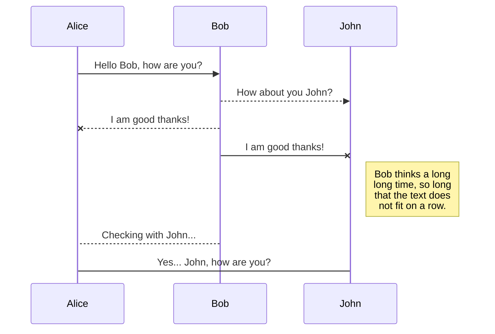

# 概述

Markdown是一种具有纯文本格式语法的轻量级标记语言。这是在GitHub等主要代码库上编写文档的事实语法。

Wiki.js支持完整的[CommonMark specification](https://spec.commonmark.org/)，并添加了一些有用的扩展（包括Github Flavored Markdown插件）。

# 用户指南

## 引用

### Tab {.tabset}

#### 用法

在每行文本之前使用**大于号**，后跟空格。

#### 快捷方法
- 选择文本，让后单击工具栏中的 {.radius-4} 按钮。

#### 示例

```js
> Lorem ipsum dolor sit amet
> Consectetur adipiscing elit
```

> Lorem ipsum dolor sit amet
> Consectetur adipiscing elit

#### 样式

通过在块引号之后空出一行，并在这一行上添加类，您可以更改块引号的外观。请注意，这些样式是Wiki.js特有的，将在其他应用程序中回退到标准的blockquote样式。

- Blue: `is-info`
- Green: `is-success`
- Yellow: `is-warning`
- Red: `is-danger`

```css
> Lorem ipsum dolor sit amet
> Consectetur adipiscing elit
{.is-info}
```

> 这是默认的未设置样式的块引用。

> 这是信息型块引用。
{.is-info}

> 这是成功型块引用。
{.is-success}

> 这是警告型块引用。
{.is-warning}

> 这是错误型块引用。
{.is-danger}

## 加粗

### Tab {.tabset}

#### 用法

在要加粗的文本前后分别添加**两个星号**。

#### 快捷方法
- 选择文本，然后单击工具栏中的 {.radius-4} 按钮。
- 选择文本，然后按 <kbd>CTRL</kbd> + <kbd>B</kbd>

#### 示例

```js
Lorem **ipsum** dolor
```

Lorem **ipsum** dolor

## 代码块

### Tab {.tabset}

#### 用法

在代码前后分别空出一行，添加三个反引号。

#### 快捷方法
- 使用左侧工具栏中的**代码块**工具。

#### 示例

````
```
function lorem (ipsum) {
	const dolor = 'consectetur adipiscing elit'
}
```
````

#### 代码高亮

默认情况下，代码块呈现为预格式化纯文本文本。然而，编程代码最好使用语法高亮显示，这样可读性更好。要指定代码块中使用的编程语言，只需在开头的三个反引号后面添加语言关键字：

````java
```java
// some code here
```
````

您可以查看支持高亮的185种编程语言的[参考列表](https://github.com/highlightjs/highlight.js#supported-languages)。

## 内容标签

### Tab {.tabset}

#### 用法

> This feature is only available from version 2.4 and up.
{.is-info}

Using headers and adding the `{.tabset}` class to the parent header. The parent header text will not be shown in the final result.

Note that you can use any header level, as long as the children headers are one level higher. For example, if a parent header is `###` *(h3)*, the tabs headers must be `####` *(h4)*. The maximum header level for a parent being 5 and the children 6.

#### 示例

```
# Tabs {.tabset}
## First Tab

Any content here will go into the first tab...

## Second Tab

Any content here will go into the second tab...

## Third Tab

Any content here will go into the third tab...
```

## Emojis

### Tab {.tabset}

#### 用法

Using the syntax `:identifier:`

See the [Emoji Cheat Sheet](https://www.webfx.com/tools/emoji-cheat-sheet/) for the full list of possible options.

#### 示例

```markdown
:apple:

Can be also be used :fire: inline
```

:apple:

Can also be used :fire: inline.

## 脚注

### Tab {.tabset}

#### 用法

Use the syntax `[^1]` for the location of the footnote in the main text, and `[^1]: this is a footnote` for the actual footnote.  Footnotes themselves will automatically appear at the bottom of the page under a horizontal line.

#### 示例

```markdown
This sentence[^1] needs a few footnotes.[^2]

[^1]: A string of syntactic words.
[^2]: A useful example sentence.
```
This sentence[^1] needs a few footnotes.[^2]

[^1]: A string of syntactic words.
[^2]: A useful example sentence.

## 标题

### Tab {.tabset}

#### 用法

Using between 1 and 6 **hashtag** symbol(s), followed by a space, before the text selection.

#### 快捷方式
- On the desired line, then clicking the {.radius-4} dropdown button in the toolbar.
- On the desired line, press <kbd>CTRL</kbd> + <kbd>ALT</kbd> +  <kbd>Right</kbd> to increase the header level.
- On the desired line, press <kbd>CTRL</kbd> + <kbd>ALT</kbd> +  <kbd>Left</kbd> to decrease the header level.

#### 示例

```
# Header 1
## Header 2
### Header 3
#### Header 4
##### Header 5
###### Header 6
```

## 分割线

### Tab {.tabset}

#### 用法

Using **triple dash** symbols on a dedicated line.

#### 快捷方法
- By clicking the {.radius-4} button in the toolbar.

#### 示例

```js
Lorem ipsum dolor

---

Consectetur adipiscing elit
```

Lorem ipsum dolor

---

Consectetur adipiscing elit

## 图片

### Tab {.tabset}

#### 用法

Using the syntax ``.

Image alt text - text that is displayed when the image could not be loaded
Image source - file path of image
Image title - is displayed when the user hovers over the picture

#### 快捷方法
- Using the **Assets** tool in the left toolbar.

#### 示例

```markdown


Consectetur  elit
```

#### 大小

Sometimes images are too large or maybe you want the image to fill up all the available space.

Simply at the dimensions at the end of the image path in the following format:

```

```

You can also omit one of the values to automatically keep the image ratio:

```


```

It's also possible to use other units, like %. Useful when you need the image to take all the available space:

```

```

## 行内代码

### Tab {.tabset}

#### 用法

Using a **backtick** symbol before and after the text selection.

#### 快捷方法
- By selecting text, then clicking the {.radius-4} button in the toolbar.

#### 示例

```js
Lorem `ipsum` dolor
```

Lorem `ipsum` dolor

## 斜体

### Tab {.tabset}

#### 用法

Using a **single asterisk** symbol before and after the text selection.

#### 快捷方法
- By selecting text, then clicking the {.radius-4} button in the toolbar.
- By selecting text, then pressing <kbd>CTRL</kbd> + <kbd>I</kbd>

#### 示例

```js
Lorem *ipsum* dolor
```

Lorem *ipsum* dolor

## 键盘按键

### Tab {.tabset}

#### 用法

Using `<kbd>` before and `</kbd>` after the text selection.

#### 快捷方法
- By selecting text, then clicking the {.radius-4} button in the toolbar.

#### 示例

```html
Lorem ipsum dolor <kbd>CTRL</kbd> + <kbd>C</kbd>
```

Lorem ipsum dolor <kbd>CTRL</kbd> + <kbd>C</kbd>

## 链接

### Tab {.tabset}

#### 用法

Using the syntax `[Link Text](Link Target)`.

#### 快捷方法
- Using the **Link** tool in the left toolbar.

#### 示例

```markdown
[Lorem ipsum](https://wiki.js.org/about)

Consectetur [adipiscing](/install/requirements) elit
```

[Lorem ipsum](https://wiki.js.org/about)

Consectetur [adipiscing](/install/requirements) elit

## Mermaid图标

### Tab {.tabset}

#### 用法

Using a code block with the language **mermaid**.

Refer to [Mermaid website](https://mermaid-js.github.io/mermaid) for the language reference.

#### 示例

````

````

## 有序列表

### Tab {.tabset}

#### 用法

Using an **number**, followed by a **dot** symbol, followed by a space, before each line of text.

#### 快捷方法
- By selecting text, then clicking the {.radius-4} button in the toolbar.

#### 示例

```
1. Lorem ipsum dolor sit amet
1. Consectetur adipiscing elit
1. Morbi vehicula aliquam
```

1. Lorem ipsum dolor sit amet
1. Consectetur adipiscing elit
1. Morbi vehicula aliquam

> While you can number each line numerically in order, it's easier to use the number **1** on each line. The final result will be incremented automatically. This way you don't need to re-number every single line when adding or removing a line later on.
{.is-info}

## PlantUML 图表

### Tab {.tabset}

#### 用法

Using a code block with the language **plantuml**.

Refer to [PlantUML website](https://plantuml.com/) for the language reference.

#### 示例

````
```plantuml
Bob->Alice : hello
```
````

```plantuml
Bob->Alice : hello
```

## 删除线

### Tab {.tabset}

#### 用法

Using **double tildes** symbols before and after the text selection.

#### 快捷方法
- By selecting text, then clicking the {.radius-4} button in the toolbar.

#### 示例

```js
Lorem ~~ipsum~~ dolor
```

Lorem ~~ipsum~~ dolor

## 下标

### Tab {.tabset}

#### 用法

Using a **single tilde** symbol before and after the text selection.

#### 快捷方法
- By selecting text, then clicking the {.radius-4} button in the toolbar.

#### 示例

```js
Lorem ~ipsum~ dolor
```

Lorem ~ipsum~ dolor

## 上标

### Tab {.tabset}

#### 用法

Using a **single caret** symbol before and after the text selection.

#### 快捷方法
- By selecting text, then clicking the {.radius-4} button in the toolbar.

#### 示例

```js
Lorem ^ipsum^ dolor
```

Lorem ^ipsum^ dolor

## 表格

### Tab {.tabset}

#### 用法

Using the syntax:

```md
| Header A1 | Header B1 | Header C1 |
|-----------|-----------|-----------|
| Cell A2   | Cell B2   | Cell C2   |
| Cell A3   | Cell B3   | Cell C3   |
...
```

#### 示例

```md
| Header 1 | Header 2 | Header 3 |
|----------|----------|----------|
| Foo      | Bar      | Xyz      |
| Abc      | Def      | 123      |
```

will result in:

| Header 1 | Header 2 | Header 3 |
|----------|----------|----------|
| Foo      | Bar      | Xyz      |
| Abc      | Def      | 123      |

#### 样式

By adding the class `dense` on a separate line, after the table, you can make the table use a smaller font and smaller padding. For example:

```md
| Header 1 | Header 2 | Header 3 |
|----------|----------|----------|
| Foo      | Bar      | Xyz      |
| Abc      | Def      | 123      |
{.dense}
```

will result in:

| Header 1 | Header 2 | Header 3 |
|----------|----------|----------|
| Foo      | Bar      | Xyz      |
| Abc      | Def      | 123      |
{.dense}


## 任务清单

### Tab {.tabset}

#### 用法

Using the syntax `- [ ]` or a `- [x]`.

#### 示例

```
- [x] Checked task item
- [x] Another checked task item
- [ ] Unchecked task item
```

- [x] Checked task item
- [x] Another checked task item
- [ ] Unchecked task item

## 无序列表

### Tab {.tabset}

#### 用法

Using an **asterisk** or a **dash** symbol, followed by a space, before each line of text.

#### 快捷方法
- By selecting text, then clicking the {.radius-4} button in the toolbar.

#### 示例

```
- Lorem ipsum dolor sit amet
- Consectetur adipiscing elit
- Morbi vehicula aliquam
```

- Lorem ipsum dolor sit amet
- Consectetur adipiscing elit
- Morbi vehicula aliquam

#### 样式

By adding a class on a separate line, after the list, you can change the look of the list:

- `links-list`
- `grid-list`

For example:

```markdown
- Grid Item 1
- Grid Item 2
- Grid Item 3
{.grid-list}

- [Lorem ipsum dolor sit amet *Subtitle description here*](https://www.google.com)
- [Consectetur adipiscing elit *Another subtitle description here*](https://www.google.com)
- [Morbi vehicula aliquam *Third subtitle description here*](https://www.google.com)
{.links-list}
```
will result in:

- Grid Item 1
- Grid Item 2
- Grid Item 3
{.grid-list}

and:

- [Link Title 1 *Subtitle description here*](https://www.google.com)
- [Link Title 2 *Another subtitle description here*](https://www.google.com)
- [Link Title 3 *Third subtitle description here*](https://www.google.com)
{.links-list}

> Note that these stylings are specific to Wiki.js and will fallback to standard list styling in other applications.
{.is-warning}
